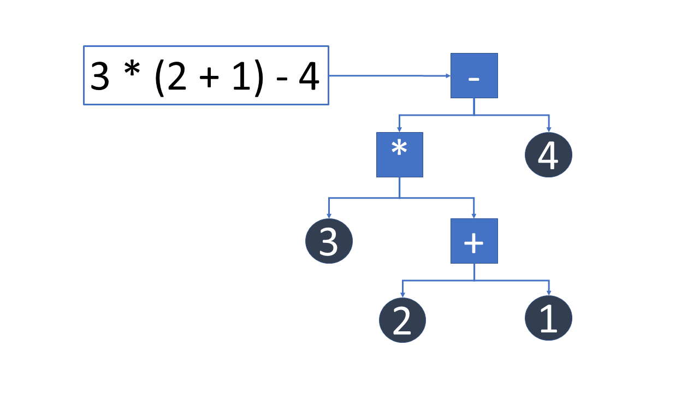

# Scripts Programming Language

## Introduction

Scripts is a programming language created for the Leo Graphics Library.  It is used to control the behavior of assets, manage animation and character interactions.  It is a free format language that handle all the basic programming types: integer, float, string and boolean. 

The language is neither interpreted or compiled, but translated into a in memory tree representation and then executed.  Each command becomes a node in a tree and upon execution the tree is traversed.  

In this example a Script expression is translated into a tree node representation.  The constants are represented by the leafs of the tree and the binary operators represent the nodes.  The nodes are the commands that are executed against the nodes children.  If a node has another node has a child, recursion is used to traverse the child node until the leafs are found.  The end result is either a value or an action that represents the commands traversed.  



Scripts does not leave a foot print.  There are no object files that need linking or dynamic linking libraries.

## First Program

```
program;
    print "Hello, World!";
end;
```

## Types

## Variables

Variables within Script follow standard convention.  All variables must begin with an upper or lower case letter or an underscore.  The characters that follow can either be letters, numbers and underscore characters.  Variables within Script are case sensitive but reserved words are not.

```
variableName
Variable_Name
variable123name
_variable
```
## Expression and Operators

## Arrays

## Looping

## Conditions

